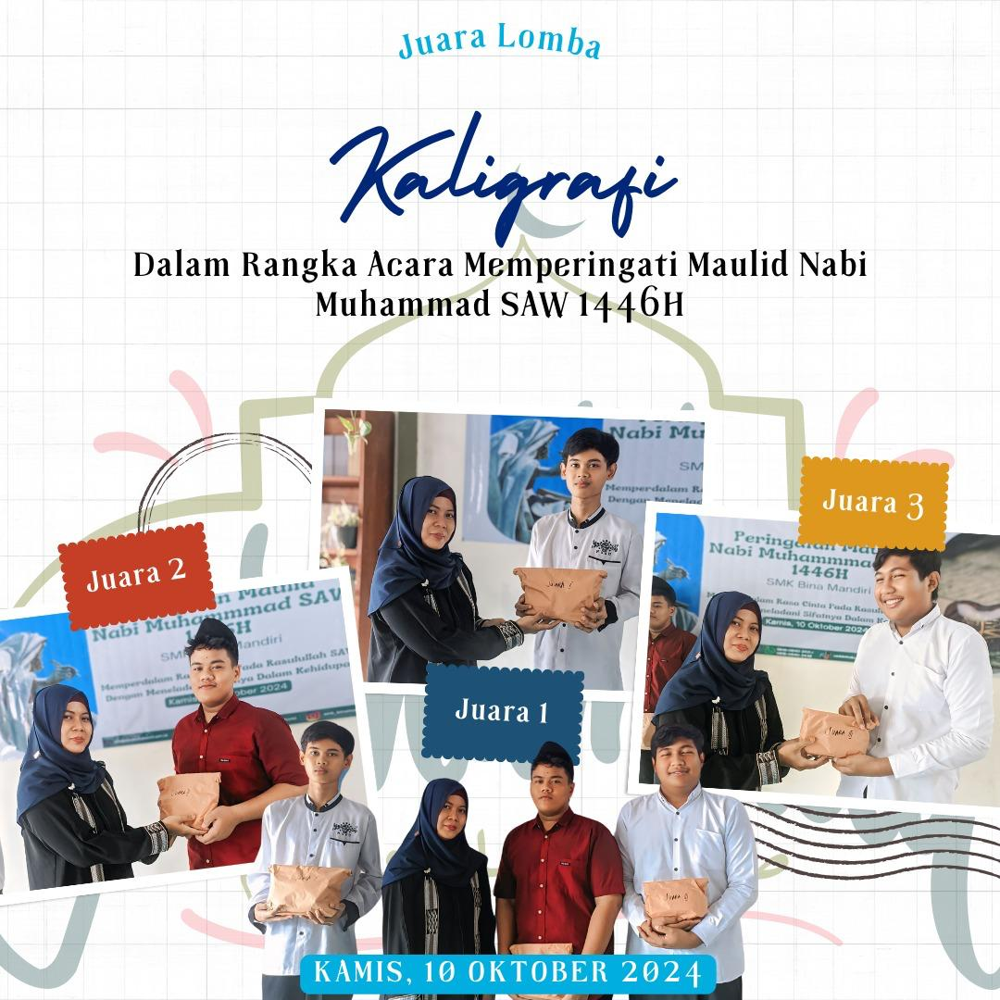

Dalam Rangka memperingati Hari Maulid nabi SMK Bina Mandiri Kuta Bumi melakukan acara kompetitif dengan menggelar Lomba, salah satunya Kaligrafi.

Banyak potensi yg menunjukan bakatnya sehingga hasil didapati maksimal,selanjutnya selaku pembina di sekolah kami akan meng eksplore bakat mereka dengan memberikan bimbingan dan edukasi.

Tak lupa kita selalu memberikan sholawat kepada baginda Nabi Muhammad yang dengan atas ajaran Alquran dan sunnah dapat membimbing kita menjadi pengikut nya.

SETIAP tahun, umat Islam di seluruh dunia memperingati Maulid Nabi Muhammad SAW sebagai momentum penting untuk mengenang kelahiran dan perjuangan Rasulullah dalam menyebarkan ajaran Islam. Maulid Nabi menjadi pengingat akan pentingnya meneladani akhlak mulia, kesederhanaan, serta kepemimpinan yang penuh kasih sayang dari Rasulullah SAW.

Di era modern yang penuh tantangan ini, peringatan Maulid Nabi memiliki relevansi yang tinggi. Nilai-nilai yang diajarkan oleh Nabi Muhammad, seperti kejujuran, tanggung jawab, dan keadilan, menjadi pedoman penting dalam menghadapi berbagai dinamika kehidupan sosial, politik, maupun ekonomi. Maulid juga menjadi momen refleksi bagi umat Islam untuk terus meningkatkan kualitas keimanan dan ketakwaan.

Meneladani Akhlak Rasulullah

Rasulullah dikenal sebagai sosok yang penuh cinta kasih dan perhatian terhadap sesama. Keteladanan beliau dalam bersikap lembut, sabar, dan penuh empati menjadi contoh yang harus diimplementasikan dalam kehidupan sehari-hari. Tidak hanya bagi sesama Muslim, tetapi juga dalam interaksi dengan berbagai lapisan masyarakat.

Maulid Nabi juga berfungsi sebagai sarana mempererat ukhuwah Islamiyah. Peringatan ini seringkali dirayakan dengan berbagai kegiatan, seperti pengajian, shalawat bersama, hingga kegiatan sosial. Dengan demikian, Maulid bukan hanya sekadar memperingati hari kelahiran Nabi, tetapi juga sebagai momentum untuk memperkuat solidaritas dan persatuan umat.

Menginspirasi Generasi Muda

Di tengah perkembangan teknologi dan informasi yang begitu pesat, generasi muda diharapkan mampu meneladani semangat juang Nabi Muhammad SAW. Rasulullah mengajarkan pentingnya ilmu pengetahuan dan etos kerja yang tinggi. Maulid Nabi dapat menjadi motivasi bagi kaum muda untuk terus belajar, berkarya, dan memberikan kontribusi positif bagi masyarakat luas.

Maulid Nabi Muhammad SAW adalah momen yang penuh makna bagi umat Islam di seluruh dunia. Ini bukan hanya waktu untuk mengenang sejarah, tetapi juga untuk menggali inspirasi dari keteladanan Rasulullah. Dengan memegang teguh nilai-nilai Islam yang diajarkan oleh Nabi Muhammad, umat Islam dapat menghadapi berbagai tantangan kehidupan dengan penuh optimisme, ketenangan, dan keikhlasan.

[row]
[col]

[/col]
[/row]